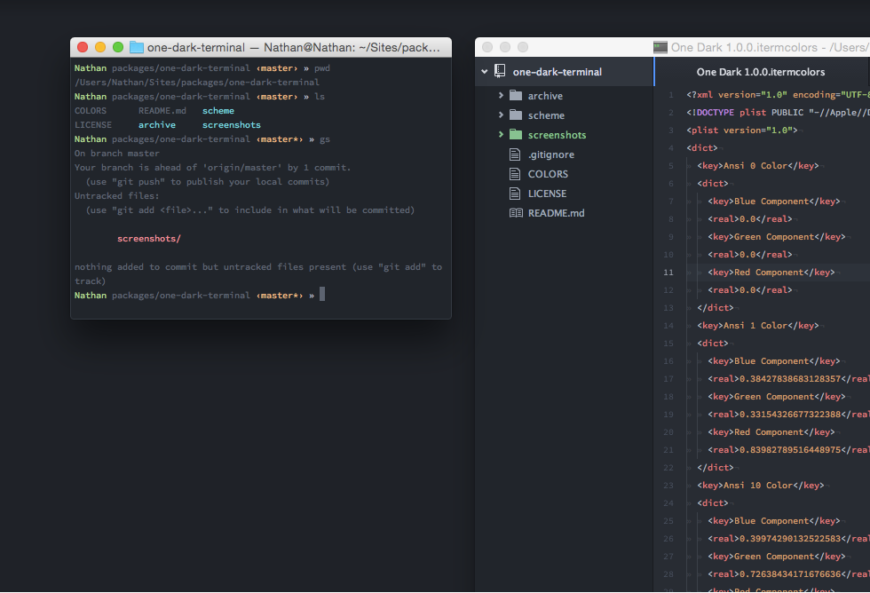
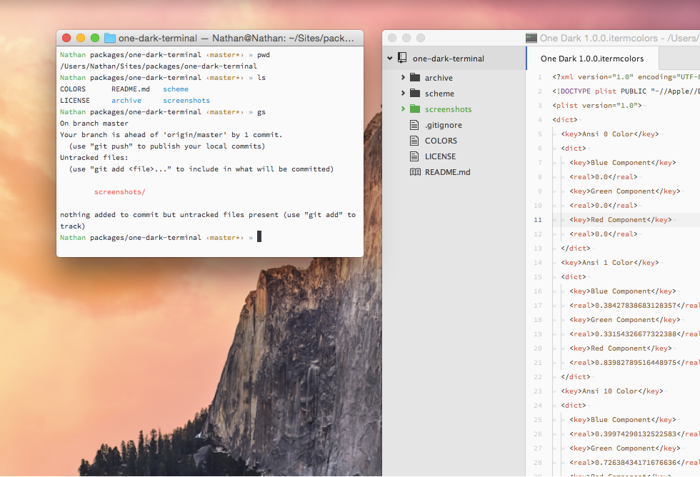

# Atom One Dark theme for Terminal

A theme for Terminal and iTerm that mimics the native [One Dark Theme](https://atom.io/themes/one-dark-syntax) made by the [Atom](http://atom.io) team. Also available in One Light.


### Colors not working?

Colors are not enabled by default in macOS Terminal, so you will need to enable colors in order for this theme to work. To do this, append the following to your `~/.bashrc` or `~/.zshrc` file, then restart Terminal
```
export CLICOLOR=1
export LSCOLORS=ExFxBxDxCxegedabagacad
```

This one line will do that for you. Copy and paste it into a Terminal window, hit <kbd>return</kbd>, then restart Terminal. For `~/.bashrc`
```
echo -e '\n# Add colors to Terminal\nexport CLICOLOR=1\nexport LSCOLORS=ExFxBxDxCxegedabagacad' >> ~/.bashrc
```
or `~/.zshrc`
```
echo -e '\n# Add colors to Terminal\nexport CLICOLOR=1\nexport LSCOLORS=ExFxBxDxCxegedabagacad' >> ~/.zshrc
```

### Changelog
- **1.0.3** - For One Dark, use the same color for "Black" as that used for the window background (`#1E2127`).
- **1.0.2** - Using a brighter text color for the One Dark theme and remove transparency from backgrounds.
- **1.0.1** - Using generic RGB for colors; 95% opaque backgrounds.
- **1.0.0** - Added One Light theme; refined colors.
- **0.7.1** - Added an alternate theme using a darker window color, based on the outer ui and not the editor space.
- **0.7.0** - Update contrast to reflect One Dark Syntax 0.7.0
- **0.5.0** - Update to lighter background and brighter colors to reflect One Dark Syntax 0.5.0


### Screenshots

**One Dark**



**One Light**




## Authors
* [Nathan Buchar](mailto:hello@nathanbuchar.com) (Owner)


## License
ISC
